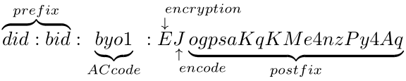
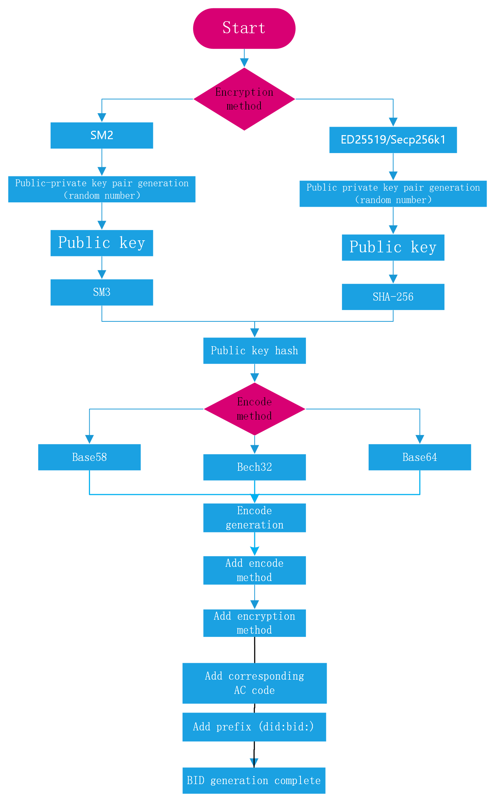

# **星火标识BID身份标识协议规范**

Version 2.0.0

## 关于

星火标识BID（Blockchain-based Identifier，简称BID），是BIF的数据载体，也是BIF-Core的原生地址，同时BID还是加入到分布式身份标识符DID注册表的一个METHOD。有关DID和DID方法规范的更多信息，请参阅[DID入门](https://github.com/WebOfTrustInfo/rebooting-the-web-of-trust-fall2017/blob/master/topics-and-advance-readings/did-primer.md)和[DID规范](https://w3c.github.io/did-core/)。

## 摘要

<code>BID</code> 为人、企业、设备和数字对象等提供分布式标识和区块链数字身份服务，旨在构建一套去中心化的、权利下放的、数据安全、隐私得到保护的并且好用的、灵活的标识符系统，能够解决人、企业、设备和数字对象等的可信连接、交互和互操作，实现万物互联、信任万物的愿景。

## 文档状态

本文档当前为 <code>2.0.0</code> 版本，在文档正式发布时，可能会由其他更新的版本替代。可以在[https://github.com/teleinfo-bif/bid/blob/master/doc/cn/](https://github.com/teleinfo-bif/bid/blob/master/doc/cn/)地址中获取本技术报告的最新版本。

## 1. <code>BID</code> 命名空间

- 标识此 <code>DID</code> 方法的method name是： <code>bid</code>

- 使用此方法的 <code>DID</code> <b>必须</b>以下前缀开头： <code>did:bid</code>。根据DID规范，此字符串<b>必须</b>为小写。在前缀之后的 <code>DID</code> 的剩余部分是由下面特定算法生成。

## 2. 适用系统

- 这种 <code>DID</code> 方法适用于星火链网，从星火链网发布开始正式使用。

## 3. <code>BID</code> 标识符

### 3.1 <code>BID</code>

- <code>BID</code> 的组成结构如下:

  

- <code>did:bid:byol</code>(AC号) 这样的 <code>BID</code> 是一类特殊的BID, 存放子链解析服务，只有前三个部分，不包含后缀。 对应的 <code>BID</code> 文档里存放子链解析地址。

- <code>BID</code> 生成方案由以下 <code>ABNF</code> 定义：

```
bid-did = "did:bid:" bid-specific-identifier ; 固定的did:bid前缀
bid-specific-identifier = 0*1(acsn ":") suffix / acsn ":" 0*1(suffix) ;
acsn(可选):后缀 或者 acsn:后缀(可选)
acsn = 4(ALPHA / DIGIT); 4个字母或数字组合
suffix = (22,42)(ALPHA / DIGIT); 长度范围22-42的字母或数字组合
```

- 生成BID地址的步骤如下定义：



加密方法：

| 公私钥支持算法 | 加密类型 |
| ----------------------- | ----------------- |
| SM2                     | 'z'               |
| ED25519                 | 'e'               |
| Secp256k1               | 's'               |

编码方法：

| 编码方式 | 编码类型 |
| ---------------- | ------------ |
| Base58           | 'f'          |
| Base64           | 's'          |
| Betch32          | 't'          |


## 4. BID 文档规范
<code>BID</code> 文档遵循 <code>DID</code> Document 规范，并在之基础上做了一定的扩展。BID文档字段说明如下：

- <code>@context</code>：必填字段。一组解释 <code>JSON-LD</code> 文档的规则，遵循 <code>DID</code> 规范，用于实现不同 <code>DID</code> Document 的互操作，必须包含 https://www.w3.org/ns/did/v1 。
- <code>version</code>：必填字段。文档的版本号，用于文档的版本升级。
- <code>id</code>：必填字段。文档的 <code>BID</code>。
- <code>publicKey</code>：选填字段。一组 <code>公钥</code>，包含：
  
    * <code>id</code>，<code>公钥</code> 的ID。
    * <code>type</code>，字符串，代表公钥的加密算法类型，支持Ed25519和SM2两种。
    * <code>controller</code>，一个 <code>BID</code>，表明此公钥的归属。
    * <code>publicKeyHex</code>，<code>公钥</code> 的十六进制编码。
- <code>authentication</code>：必填字段。一组 <code>公钥</code> 的 <code>BID</code>，表明此 <code>BID</code> 的归属，拥有此公钥对应私钥的一方可以控制和管理此 <code>BID</code> 文档。
- <code>alsoKnownAs</code>：选填字段。一组和本 <code>BID</code> 相关联的其他 <code>ID</code>，包括：
    * <code>type</code>，关联标识的类型。
    * <code>id</code>，关联的标识。
- <code>extension</code>：BID扩展字段。包含如下字段：
  
    * <code>recovery</code>，选填字段。一组 <code>公钥</code> <code>id</code>， 在 <code>authentication私钥</code> 泄漏或者丢失的情况下用来恢复对文档的控制权。
    * <code>ttl</code>，必填字段。Time-To-Live，即如果解析使用缓存的话缓存生效的时间，单位秒。
    * <code>delegateSign</code>，选填字段。第三方对 <code>publicKey</code> 的签名，可信解析使用。包括：
        * <code>signer</code>，签名者，这里是一个<code>公钥</code>的 <code>id</code>。
        * <code>signatureValue</code>，使用相应 <code>私钥</code> 对 <code>publicKey</code> 字段的签名。
    * <code>type</code>， <code>BID</code> 文档的属性类型。
- <code>attributes</code>：必填字段。一组属性。包含如下字段：
    | 参数 | 描述 |
    |----| ----|
    | key | 属性的关键字 | 
    | desc | 选填。属性描述 |
    | encrypt | 选填。是否加密，0非加密，1加密 |
    | format | 选填。image、text、video、mixture等数据类型 |
    | value | 选填。属性自定义value |
- <code>acsns</code>：选填字段。一组子链 <code>AC</code> 号，只有 <code>BID</code> 文档类型不是凭证类型且文档是主链上的 <code>BID</code> 文档才可能有该字段，存放当前BID拥有的所有 <code>AC</code> 号。
* <code>verifiableCredentials</code>：选填字段。凭证列表，包含：
    * <code>id</code>，可验证声明的BID
    * <code>type</code>，凭证类型
* <code>service</code>，选填字段。一组服务地址，包含：
    * <code>id</code>，服务地址的 <code>id</code>
    * <code>type</code>，字符串，代表服务的类型
    * <code>serviceEndPoint</code>，一个 <code>URI</code> 地址
    * 当 <code>type</code> 为子链解析服务时，service为以下结构：

        | 参数 | 描述 |
        | ----- | ---- |
        | id | 服务地址的ID |
        | type | DIDSubResolver | 
        | version | 服务支持的BID解析协议版本 | 
        | protocol | 解析协议支持的传输协议类型 | 
        | serverType | 服务地址类型，0为域名形式，1为IP地址形式 |
        | serviceEndpoint | 解析地址的IP或域名 |
        | port | serverType为1时有该字段，解析服务的端口号 |

* <code>created</code>：必填字段。创建时间
* <code>updated</code>: 必填字段。上次的更新时间
* <code>proof</code>：选填字段。文档所有者对文档内容的签名，包含：
    * <code>creator</code>， <code>proof</code> 的创建者，这里是一个<code>公钥</code> 的 <code>id</code>
    * <code>signatureValue</code>，使用相应私钥对除 <code>proof</code> 字段的整个BID文档签名 

<code>BID</code> 文档示例：
```json
{
    "@context": ["https://www.w3.org/ns/did/v1"],
    "version": "1.0.0",
    "id": "did:bid:efnVUgqQFfYeu97ABf6sGm3WFtVXHZB2",
	"publicKey": [{
        "id": "did:bid:efnVUgqQFfYeu97ABf6sGm3WFtVXHZB2#key-1",
        "type": "Ed25519",
        "controller": "did:bid:efnVUgqQFfYeu97ABf6sGm3WFtVXHZB2",
        "publicKeyHex": "b9906e1b50e81501369cc777979f8bcf27bd1917d794fa6d5e320b1ccc4f48bb" 
    }, {
        "id": "did:bid:efnVUgqQFfYeu97ABf6sGm3WFtVXHZB2#key-2",
        "type": "Ed25519",
        "controller": "did:bid:efnVUgqQFfYeu97ABf6sGm3WFtVXHZB2",
        "publicKeyHex": "31c7fc771eba5b511b7231e9b291835dd4ebde51cc0e757a84464e7582aba652"
        }],
	"authentication":["did:bid:efnVUgqQFfYeu97ABf6sGm3WFtVXHZB2#key-1"],
	"extension": {
        "recovery": ["did:bid:efnVUgqQFfYeu97ABf6sGm3WFtVXHZB2#key-2"],
        "ttl": 86400,
        "delegateSign ": {
            "signer": "did:bid:efJgt44mNDewKK1VEN454R17cjso3mSG#key-1",
            "signatureValue": "eyJhbGciOiJSUzI1NiIsImI2NCI6ZmFsc2UsImNyaXQiOlsiYjY0Il19"
        },
        "type": 206
    },
    "service": [{
        "id": "did:bid:ef24NBA7au48UTZrUNRHj2p3bnRzF3YCH#subResolve",
        "type": "DIDSubResolve",
        "version": "1.0.0",
        "serverType": 1,
        "protocol": 3,
        "serviceEndpoint": "192.168.1.23",
        "port": 8080
    }],
    "created": "2021-05-10T06:23:38Z",
    "updated": "2021-05-10T06:23:38Z",
    "proof": {
        "creator": "did:bid:efJgt44mNDewKK1VEN454R17cjso3mSG#key-1",
        "signatureValue": "9E07CD62FE6CE0A843497EBD045C0AE9FD6E1845414D0ED251622C66D9CC927CC21DB9C09DFF628DC042FCBB7D8B2B4901E7DA9774C20065202B76D4B1C15900"
    }
} 
```

## 5. <code>BID</code> 方法

### 5.1 <code>create</code>

注册接口主要完成BID文档的注册,支持http POST 方法。创建 <code>BID</code> 文档时 <code>proof</code> 字段的签名者需要是 <code>authentication</code> 字段里的 <code>公钥</code> 才有权限创建成功。

| 参数  | 字段类型   | 描述                     |
| ----------- | ------ | ------------------------------- |
| id          | String | 要创建的BID              |
| operation   | String | "create"                        |
| didDocument | Object | 要创建的BID文档 |

请求示例：

```json
{
    "id":"did:bid:efnVUgqQFfYeu97ABf6sGm3WFtVXHZB2",
    "operation": "create",
    "didDocument": {
        "@context": ["https://www.w3.org/ns/did/v1"],
        "version": "1.0.0",
        "id": "did:bid:efnVUgqQFfYeu97ABf6sGm3WFtVXHZB2",
        "publicKey": [{
            "id": "did:bid:efnVUgqQFfYeu97ABf6sGm3WFtVXHZB2#key-1",
            "type": "Ed25519",
            "controller": "did:bid:efnVUgqQFfYeu97ABf6sGm3WFtVXHZB2",
            "publicKeyHex": "b9906e1b50e81501369cc777979f8bcf27bd1917d794fa6d5e320b1ccc4f48bb"
        }, {
            "id": "did:bid:efnVUgqQFfYeu97ABf6sGm3WFtVXHZB2#key-2",
            "type": "Ed25519",
            "controller": "did:bid:efnVUgqQFfYeu97ABf6sGm3WFtVXHZB2",
            "publicKeyHex": "31c7fc771eba5b511b7231e9b291835dd4ebde51cc0e757a84464e7582aba652"
        }],
        "authentication": ["did:bid:efnVUgqQFfYeu97ABf6sGm3WFtVXHZB2#key-1"],
        "extension": {
            "recovery": ["did:bid:efnVUgqQFfYeu97ABf6sGm3WFtVXHZB2#key-2"],
            "ttl": 86400,
            "delegateSign ": {
                "signer": "did:bid:efJgt44mNDewKK1VEN454R17cjso3mSG#key-1",
                "signatureValue": "eyJhbGciOiJSUzI1NiIsImI2NCI6ZmFsc2UsImNyaXQiOlsiYjY0Il19"
            },
            "type": 206
        },
        "service": [{
            "id": "did:bid:ef24NBA7au48UTZrUNRHj2p3bnRzF3YCH#subResolve",
            "type": "DIDSubResolve",
            "version": "1.0.0",
            "serverType": 1,
            "protocol": 3,
            "serviceEndpoint": "192.168.1.23",
            "port": 8080
        }],
        "created": "2021-05-10T06:23:38Z",
        "updated": "2021-05-10T06:23:38Z",
        "proof": {
            "creator": " did:bid:efnVUgqQFfYeu97ABf6sGm3WFtVXHZB2#key-1",
            "signatureValue":   "9E07CD62FE6CE0A843497EBD045C0AE9FD6E1845414D0ED251622C66D9CC927CC21DB9C09DFF628DC042FCBB7D8B2B4901E7DA9774C20065202B76D4B1C15900"
        }
    }
}
```

返回示例：
```json
{
    "errorCode": 1,
    "message": "without permission"
}
```

### 5.2 <code>update</code>

更新接口主要完成BID文档的更新，支持http POST 方法。更新操作不允许更新 <code>authentication</code> 字段，更新 <code>BID</code> 文档时 <code>proof</code> 字段的签名者需要是 <code>authentication</code> 字段里的 <code>公钥</code> 才有权限更新成功。

| 参数   | 字段类型   | 描述                    |
| ----------- | ------ | ------------------------------- |
| id          | String | 要创建的BID             |
| operation   | String | "create"                        |
| didDocument | Object | 更新后的BID文档 |

请求示例：
```json
{
    "id": "did:bid:efnVUgqQFfYeu97ABf6sGm3WFtVXHZB2",
    "operation": "update",
    "didDocument": {
        "@context": ["https://www.w3.org/ns/did/v1"],
        "version": "1.0.0",
        "id": "did:bid:efnVUgqQFfYeu97ABf6sGm3WFtVXHZB2",
        "publicKey": [{
            "id": "did:bid:efnVUgqQFfYeu97ABf6sGm3WFtVXHZB2#key-1",
            "type": "Ed25519",
            "controller": "did:bid:efnVUgqQFfYeu97ABf6sGm3WFtVXHZB2",
            "publicKeyHex": "b9906e1b50e81501369cc777979f8bcf27bd1917d794fa6d5e320b1ccc4f48bb"
        }, {
            "id": "did:bid:efnVUgqQFfYeu97ABf6sGm3WFtVXHZB2#key-2",
            "type": "Ed25519",
            "controller": "did:bid:efnVUgqQFfYeu97ABf6sGm3WFtVXHZB2",
            "publicKeyHex": "31c7fc771eba5b511b7231e9b291835dd4ebde51cc0e757a84464e7582aba652"
        }],
        "authentication":["did:bid:efnVUgqQFfYeu97ABf6sGm3WFtVXHZB2#key-1"], 
        "extension": {
            "recovery": ["did:bid:efnVUgqQFfYeu97ABf6sGm3WFtVXHZB2#key-2"],
            "ttl": 86400,
            "delegateSign ": {
                "signer": "did:bid:efJgt44mNDewKK1VEN454R17cjso3mSG#key-1",
                "signatureValue": "eyJhbGciOiJSUzI1NiIsImI2NCI6ZmFsc2UsImNyaXQiOlsiYjY0Il19"
            },
            "type": 206
        },
        "service": [{
            "id": "did:bid:ef24NBA7au48UTZrUNRHj2p3bnRzF3YCH#subResolve",
            "type": "DIDSubResolve",
            "version": "1.0.0",
            "serverType": 1,
            "protocol": 3,
            "serviceEndpoint": "192.168.1.23",
            "port": 8080
        }],
        "created": "2021-05-10T06:23:38Z",
        "updated": "2021-05-10T06:23:38Z",
        "proof": {
            "creator": " did:bid:efnVUgqQFfYeu97ABf6sGm3WFtVXHZB2#key-1",
            "signatureValue": "9E07CD62FE6CE0A843497EBD045C0AE9FD6E1845414D0ED251622C66D9CC927CC21DB9C09DFF628DC042FCBB7D8B2B4901E7DA9774C20065202B76D4B1C15900"
        }
    }
}   
```

返回示例：
```json
{
    "errorCode": 0,
    "message": "success"
}
```

### 5.3 <code>read</code>

根据BID查询BID文档信息，支持http Get方法。返回值为 <code>BID</code> 文档的 <code>JSON</code> 字符串。

返回普通的BID文档：

| 参数                                                   | 字段类型       | 描述                                                          |
| ------------------------------------------------------ | ------------- | ------------------------------------------------------------ |
| errorCode                                              | Int           | 见响应码说明                                               |
| data.didDocument                                       | Object        | 解析结果                                            |
| data.didDocument.@context                              | Array         | 一组url数组                                                         |
| data.didDocument.version                               | String        | BID文档的版本                                  |
| data.didDocument.id                                    | String        | 解析的BID                                               |
| data.didDocument.publicKey                             | Array(Object) | 公钥                                                   |
| data.didDocument.publicKey.id                          | String        | 公钥id                                              |
| data.didDocument.publicKey.type                        | String        | 公钥算法类型                                   |
| data.didDocument.publicKey.controller                  | String        | 一个BID,表明此公钥的归属                    |
| data.didDocument.publicKey.publicKeyHex                | String        | 十六进制公钥                                            |
| data.didDocument.authentication                        | Array         | 一组公钥id                                                |
| data.didDocument.alsoKnownAs                           | Array(Object) | 关联id                                              |
| data.didDocument.alsoKnownAs.type                      | Int           | 关联id的类型                                             |
| data.didDocument.alsoKnownAs.id                        | String        | 关联id                                              |
| data.didDocument.extension                             | Object        | 扩展字段                                            |
| data.didDocument.extension.recovery                    | Array         | 一组公钥id                                               |
| data.didDocument.extension.ttl                         | long          | 缓存时间，单位秒                                       |
| data.didDocument.extension.delegateSign                | Object        | 第三方对publicKey的签名，可信解析使用                          |
| data.didDocument.extension.delegateSign.signer         | String        | 签名公钥id                                 |
| data.didDocument.extension.delegateSign.signatureValue | String        | 签名的base58编码                                  |
| data.didDocument.extension.type                        | Int           | 属性类型                                                 |
| data.didDocument.extension.attributes                  | Array(Object) | 一组属性,属性结构见下文说明 |
| data.didDocument.extension.acsns                       | Array(Object) | AC号列表                                                |
| data.didDocument.extension.verfiableCredentials        | Array(Object) | 凭证列表，只有主链非凭证类型的BID文档才可能有本字段 |
| data.didDocument.extension.verfiableCredentials.id     | String        | 凭证ID                                               |
| data.didDocument.extension.verifiableCredentials.type  | Int           | 凭证类型                                              |
| data.didDocument.service                               | Array(Object) | 一组服务地址，结构见下表                                            |
| data.didDocument.service.id                            | String        | 服务地址的ID                                        |
| data.didDocument.service.type                          | String        | 字符串，代表服务的类型                                         |
| data.didDocument.service.serviceEndpoint               | String        | 服务的URL地址                                                |
| data.didDocument.created                               | String        | 创建时间                                          |
| data.didDocument.updated                               | String        | 上次的更新时间                                          |
| data.didDocument.proof                                 | Object        | 签名信息                                      |
| data.didDocument.proof.creator                         | String        | 签名公钥id                                      |
| data.didDocument.proof.signatureValue                  | String        | 签名的base58编码                                  |

其中 <code>attributes</code> 结构如下：
| 参数                                   | 字段类型   | 描述                     |
| --------------------------------------------- | ------ | ------------------------------------- |
| data.didDocument.extension.attributes.key     | String | 属性的key                     |
| data.didDocument.extension.attributes.desc    | String | 属性的描述                           |
| data.didDocument.extension.attributes.encrypt | Int    | 是否加密，0非加密，1加密   |
| data.didDocument.extension.attributes.format  | String | image、text、video、mixture等数据类型 |
| data.didDocument.extension.attributes.value   | String | 属性自定义value  |

当 <code>service.type</code> 为子链解析服务时,service结构如下：

| 参数                              | 字段类型   | 描述                                       |
| ---------------------------------------- | ------ | ---------------------------------------------------- |
| data.didDocument.service.id              | String | 服务地址的ID                              |
| data.didDocument.service.type            | String | 字符串，代表服务的类型                             |
| data.didDocument.service.version         | String | 解析服务支持的BID协议版本 |
| data.didDocument.service.protocol        | Int    | 解析服务支持的传输协议   |
| data.didDocument.service.serverType      | Int    | 解析地址类型                           |
| data.didDocument.service.serviceEndpoint | String | 解析地址                           |
| data.didDocument.service.port            | Int    | 解析端口                                |

返回示例：
- 成功返回普通 <code>BID</code> 文档：
```json
{
    "errorCode": 0,
    "data": {
        "didDocument": {
            "@context": ["https://www.w3.org/ns/did/v1"],
            "version": "1.0.0",
            "id":"did:bid:efnVUgqQFfYeu97ABf6sGm3WFtVXHZB2",
            "publicKey": [{
                "id": "did:bid:efnVUgqQFfYeu97ABf6sGm3WFtVXHZB2#key-1",
                "type": "Ed25519",
                "controller": "did:bid:efnVUgqQFfYeu97ABf6sGm3WFtVXHZB2",
                "publicKeyHex": "b9906e1b50e81501369cc777979f8bcf27bd1917d794fa6d5e320b1ccc4f48bb"
            }],
            "authentication": ["did:bid:efnVUgqQFfYeu97ABf6sGm3WFtVXHZB2#key-1"],
            "extension": {
                "recovery": ["did:bid:efnVUgqQFfYeu97ABf6sGm3WFtVXHZB2#key-2"],
                "ttl": 86400,
                "delegateSign ": {
                    "signer": "did:bid:efJgt44mNDewKK1VEN454R17cjso3mSG#key-1",
                    "signatureValue": "eyJhbGciOiJSUzI1NiIsImI2NCI6ZmFsc2UsImNyaXQiOlsiYjY0Il19"
                },
                "type": 206
            },
            "service": [{
                "id": "did:bid:ef24NBA7au48UTZrUNRHj2p3bnRzF3YCH#subResolve",
                "type": "DIDSubResolve",
                "serviceEndpoint": "www.caict.cn"
            }],
            "created": "2021-05-10T06:23:38Z",
            "updated": "2021-05-10T06:23:38Z",
            "proof": {
                "creator": "did:bid:efJgt44mNDewKK1VEN454R17cjso3mSG#key-1",
                "signatureValue": "9E07CD62FE6CE0A843497EBD045C0AE9FD6E1845414D0ED251622C66D9CC927CC21DB9C09DFF628DC042FCBB7D8B2B4901E7DA9774C20065202B76D4B1C15900"
            }
        }
    },
    "message": "success"
}
```
- 成功返回包含子链解析服务地址的 <code>BID</code> 文档示例：

```json
{
    "errorCode": 0,
    "message": "success",
    "data": {
        "didDocument": {
            "@context": ["https://www.w3.org/ns/did/v1"],
            "version": "1.0.0",
            "id": "did:bid:efnVUgqQFfYeu97ABf6sGm3WFtVXHZB2",
            "publicKey": [{
                    "id": "did:bid:efnVUgqQFfYeu97ABf6sGm3WFtVXHZB2#key-1",
                    "type": "Ed25519",
                    "controller": "did:bid:efnVUgqQFfYeu97ABf6sGm3WFtVXHZB2",
                    "publicKeyHex": "b9906e1b50e81501369cc777979f8bcf27bd1917d794fa6d5e320b1ccc4f48bb"
            }],
            "authentication": ["did:bid:efnVUgqQFfYeu97ABf6sGm3WFtVXHZB2#key-1"],
            "extension": {
                "recovery": ["did:bid:efnVUgqQFfYeu97ABf6sGm3WFtVXHZB2#key-2"],
                "ttl": 86400,
                "delegateSign ": {
                    "signer": "did:bid:efJgt44mNDewKK1VEN454R17cjso3mSG#key-1",
                    "signatureValue": "eyJhbGciOiJSUzI1NiIsImI2NCI6ZmFsc2UsImNyaXQiOlsiYjY0Il19"
                },
                "type": 206
            },
            "service": [{
                    "id": "did:bid:ef24NBA7au48UTZrUNRHj2p3bnRzF3YCH#subResolve",
                    "type": "DIDSubResolve",
                    "version": "1.0.0",
                    "serverType": 1,
                    "protocol": 3,
                    "serviceEndpoint": "192.168.1.23",
                    "port": 8080
            }],
            "proof": {
                "creator": "did:bid:efJgt44mNDewKK1VEN454R17cjso3mSG#key-1",
                "signatureValue": " eyJhbGciOiJSUzI1NiIsImI2NCI6ZmFsc2UsImNyaXQiOlsiYjY0Il19"
            }
        }
    },
    "message": "success"
}
```

   失败返回示例：

```json
{
    "errorCode": 6,
    "message": "not found"
}
```

### 5.4 <code>deactivate</code> 停用

<code>Deactivate</code> 接口主要完成对 <code>BID</code> 文档撤销，支持 <code>http POST</code> 方法。撤销后的 <code>BID</code> 文档更新为空而不是删除, 停用 <code>BID</code> 文档时 <code>proof</code> 字段的签名者需要是 <code>recovery</code> 字段里的 <code>公钥</code> 才有权限停用成功。

| 参数 | 字段类型   | 描述                              |
| --------- | ------ | ---------------------------------------- |
| id        | String | 要创建的BID                |
| operation | String | "delete"                                 |
| proof     | Object | recovery字段里的公钥对请求体的签名 |

请求示例：
```json
{
    "id": "did:bid:efnVUgqQFfYeu97ABf6sGm3WFtVXHZB2",
    "opratiton": "delete",
    "proof": {
        "creator": "did:bid:efnVUgqQFfYeu97ABf6sGm3WFtVXHZB2#key-1",
        "signatureValue": "9E07CD62FE6CE0A843497EBD045C0AE9FD6E1845414D0ED251622C66D9CC927CC21DB9C09DFF628DC042FCBB7D8B2B4901E7DA9774C20065202B76D4B1C15900"
    }
}
```
返回示例：
```json
{
    "errorCode": 0,
    "message": "success"
}
```

### 5.5 <code>recovery</code>

<code>Recovery</code> 接口主要完成对 <code>BID</code> 文档里的 <code>authentication</code> 和 <code>publicKey</code> 字段里的内容修改，支持 <code>http POST</code> 方法。更换密钥时 <code>proof</code> 字段的签名者需要是 <code>recovery</code> 字段里的 <code>公钥</code> 才有权限更换成功。

| 参数       | 字段类型   | 描述               |
| ---------------- | ------ | --------------------------- |
| id               | String | 要创建的BID         |
| operation        | String | "recovery"                  |
| didDocumentation | Object | 更新后的BID文档 |

请求示例：
```json
{
    "id": "did:bid:efnVUgqQFfYeu97ABf6sGm3WFtVXHZB2",
    "operation": "recovery",
    "didDocument": {
        "@context": ["https://www.w3.org/ns/did/v1"],
        "version": "1.0.0",
        "id": "did:bid:efnVUgqQFfYeu97ABf6sGm3WFtVXHZB2",
        "publicKey": [{
            "id": "did:bid:efnVUgqQFfYeu97ABf6sGm3WFtVXHZB2#key-3",
            "type": "Ed25519",
            "controller": "did:bid:efnVUgqQFfYeu97ABf6sGm3WFtVXHZB2",
            "publicKeyHex": "b9906e1b50e81501369cc777979f8bcf27bd1917d794fa6d5e320b1ccc4f48bb"
        }, {
            "id": "did:bid:efnVUgqQFfYeu97ABf6sGm3WFtVXHZB2#key-2",
            "type": "Ed25519",
            "controller": "did:bid:efnVUgqQFfYeu97ABf6sGm3WFtVXHZB2",
            "publicKeyHex": "31c7fc771eba5b511b7231e9b291835dd4ebde51cc0e757a84464e7582aba652"
        }],
        "authentication": ["did:bid:efnVUgqQFfYeu97ABf6sGm3WFtVXHZB2#key-3"],
        "extension": {
            "recovery": ["did:bid:efnVUgqQFfYeu97ABf6sGm3WFtVXHZB2#key-2"],
            "ttl": 86400, "delegateSign ": {
                "signer": "did:bid:efJgt44mNDewKK1VEN454R17cjso3mSG#key-1",
                "signatureValue": "eyJhbGciOiJSUzI1NiIsImI2NCI6ZmFsc2UsImNyaXQiOlsiYjY0Il19"
            },
            "type": 206
        },
        "service": [{
            "id": "did:bid:ef24NBA7au48UTZrUNRHj2p3bnRzF3YCH#subResolve",
            "type": "DIDSubResolve",
            "version": "1.0.0",
            "serverType": 1,
            "protocol": 3,
            "serviceEndpoint": "192.168.1.23",
            "port": 8080
        }],
        "created": "2021-05-10T06:23:38Z",
        "updated": "2021-05-10T06:23:38Z",
        "proof": {
            "creator": " did:bid:efnVUgqQFfYeu97ABf6sGm3WFtVXHZB2#key-2",
            "signatureValue": "9E07CD62FE6CE0A843497EBD045C0AE9FD6E1845414D0ED251622C66D9CC927CC21DB9C09DFF628DC042FCBB7D8B2B4901E7DA9774C20065202B76D4B1C15900"
        }
    }
}
```

返回示例：
```json
{
    "errorCode": 0,
    "message": "success"
}
```

## 6. 安全和隐私考虑

### 6.1 安全考虑
BID方法考虑到以下安全性：
- 防止 <code>DDOS</code> 攻击：
 <code>BID</code> 系统基于区块链技术构建，天然防止 <code>DDOS</code> 攻击。

- 防止隐私数据盗窃攻击：
 在 <code>BID</code> 系统中，所有与用户隐私相关的数据都存储在本地。仅加密算法生成的 <code>hash</code> 或字符串在链上是公开的，攻击者无法通过哈希值或字符串导出隐私数据。

- 共识安全：
 BID 采用 <code>DPOS</code> 和 <code>PBFT</code> 两层共识算法保持区块链节点的稳定性。

### 6.2 隐私注意事项

为保护用户隐私数据的安全，BID不仅将所有隐私相关数据保存在客户端本地，还在签名过程中，进行了排序、数据压缩、Base58编码等，进一步加强隐私数据保护。在各种安全措施的保护下，用户的隐私数据不会被上传到链上或泄露。并且无法通过链上数据导出个人信息。
