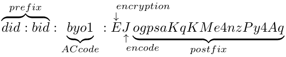

# **BID Protocol Specification**

Version 2.0.0

## About

Xinghuo BID (Blockchain-based Identifier, also as BID)is the data carrier of BIF and the native address of BIF-core. BID is also a METHOD added to the DID registry. BID method specification conforms to the requirements specified in the DID specification currently published by the W3C Credentials Community Group. For more information about DIDs and DID method specifications, please see the [DID Primer](https://github.com/WebOfTrustInfo/rebooting-the-web-of-trust-fall2017/blob/master/topics-and-advance-readings/did-primer.md) and [DID Spec](https://w3c-ccg.github.io/did-spec/).

## Abstract

<code>BID</code> provides distributed identifiers and blockchain-based digital identity services for people, enterprises, devices and digital objects. It aims to build a decentralized, decentralized in authority, data-secure, privacy-protected and flexible identifier system that addresses trusted connections, interaction and interoperation among people, enterprises, devices and digital objects, enabling the vision of the <code>IoT</code> (Internet of Things) and trust ingress with everything.

## Status Of This Document

This document is now version <code>2.0.0</code> for <code>BID</code> specification and will be further updated. You can get access to the latest version by visiting  [https://github.com/teleinfo-bif/bid/blob/master/doc/en/](https://github.com/teleinfo-bif/bid/blob/master/doc/en/).

## 1. <code>BID</code> Method

- The name string that shall identify this <code>DID</code> method is <code>bid</code>

- A <code>DID</code> that generated by this method <b>MUST</b> begin with the following prefix: <code>did:bid</code>. Per the DID specification, this string <b>MUST</b> be lowercase. The remaining part of the <code>DID</code>, following the prefix, is generated with postceding algorithm.

## 2. System Requirement

- This <code>DID</code> method is applicable to the BIF network and has been used formally since the BIF released.

## 3. <code>BID</code> Identifier

### 3.1 <code>BID</code>

- <code>BID</code> is structured as following:

  

- <code>did:bid:byol</code> is a special kind of <code>BID</code>, not encompsassing the postfix. It stores sidechain resolution service, and its resolution addresse can be found in the corresponding <code>BID</code> documentation.

- <code>BID</code> is initialized by the following <code>ABNF</code>:

```
bid-did = "did:bid:" bid-specific-identifier 
bid-specific-identifier = 0*1(acsn ":") suffix / acsn ":" 0*1(suffix) 
acsn = 4(ALPHA / DIGIT); 
suffix = (22,42)(ALPHA / DIGIT);
```

- Steps taken to generate BID address is specified as following:


Encryption method:

| Cryptographic algorithm | Encryption method |
| ----------------------- | ----------------- |
| SM2                     | 'z'               |
| ED25519                 | 'e'               |
| Secp256k1               | 's'               |

Encode method:

| Encode algorithm | Encode mehod |
| ---------------- | ------------ |
| Base58           | 'f'          |
| Base64           | 's'          |
| Betch32          | 't'          |


## 4. BID Documentation
<code>BID</code> documentation follows from that of <code>DID</code>'s, and makes some extension. Specified keywords are: 

- <code>@context</code>: required field, explanation of <code>JSON-LD</code>, following <code>DID</code> documentation.It is used to realize the interoperation of different  <code>DID</code> Documents,which must include https://www.w3.org/ns/did/v1 .
- <code>version</code>:  required field, documentation version, used for version upgrade
- <code>id</code>:  required field, documentation <code>BID</code>
- <code>publicKey</code>:  optional field, a set of <code>publicKey</code>, including
  
    * <code>id</code>, <code>publicKey</code>'s id
    * <code>type</code>, encryption method,support Ed25519 and SM2.
    * <code>controller</code>, a <code>BID</code>, indicating the ownership of public key.
    * <code>publicKeyHex</code>, <code>publicKey</code>'s hex encode
- <code>authentication</code>:  required field, <code>BID</code> of a set of<code>publicKey</code>, revealing the holder of the <code>BID</code>.The party that owns the public key corresponding to the private key can control and manage the <code>BID</code> document.  
- <code>alsoKnownAs</code>: optional field, a set of <code>ID</code> related to <code>BID</code>, including
    * <code>type</code>, related identifiers' types
    * <code>id</code>, related identifiers.
- <code>extension</code>: extension field, including
    
    * <code>recovery</code>, optional field, <code>id</code> of a set of <code>publicKey</code> used to recover control when <code>authentication privateKey</code> is compromised or lost 
    * <code>ttl</code>,  required field, Time-To-Live, when resolution service requires usage of cache
    * <code>delegateSign</code>, optional field, third party signature to <code>publicKey</code>, used for trusted resolution, including
        * <code>signer</code>, <code>id</code> of <code>publicKey</code>
        * <code>signatureValue</code>, signature generated with <code>publicKey</code>'s corresponding <code>privateKey</code>
    * <code>type</code>, property type of <code>BID</code> documentation
- <code>attributes</code>: required field, a set of properties, including
    | Parameter | Description |
    |----| ----|
    | key | keyword of property | 
    | desc | optional field, description of property |
    | encrypt | optional field, whether to encrypt or not, 0 is not, 1 otherwise |
    | format | optional field, image,text,video,mixture or other data type |
    | value | optional field, user-defined value of property |
- <code>acsns</code>: optional field, side-chain <code>AC</code> code. <code>BID</code> documentation is the sole type  not belonging to credential type. On extra, only <code>BID</code> documentation on main-chain can have this field, encapsulating all of the <code>AC</code> codes.
* <code>verifiableCredentials</code>: optional field, credentials list, including
    * <code>id</code>, BID of verifiable claim
    * <code>type</code>, type of credentials
* <code>service</code>: optional field comprising service addresses, including
    * <code>id</code>, service address' <code>id</code>
    * <code>type</code>, string representing service type
    * <code>serviceEndPoint</code>, <code>URI</code> address
    *  When <code>type</code> is sidechain resolution service, the structure of service is:

        | Parameter | Description |
        | ----- | ---- |
        | id | ID of service address|
        | type | DIDSubResolver | 
        | version | BID resolution protocol version supported by service | 
        | protocol | transfer protocol type supported by resolution protocol | 
        | serverType | service address type, 0 for DNS, 1 for IP address |
        | serviceEndpoint | IP or DNS of resolution address |
        | port | set when serverType is 1, the port number of resolution service |

* <code>created</code>: mandatory field, time of creation
* <code>updated</code>: mandatory field, time of last update
* <code>proof</code>: optional field, documentation owner's signature on documentation's content, including
    * <code>creator</code>, creator of <code>proof</code>, <code>id</code> of <code>publicKey</code>
    * <code>signatureValue</code>, signature on the entire documentation except <code>proof</code> field

<code>BID</code> documentation example:
```json
{
    "@context": ["https://www.w3.org/ns/did/v1"],
    "version": "1.0.0",
    "id": "did:bid:efnVUgqQFfYeu97ABf6sGm3WFtVXHZB2",
	"publicKey": [{
        "id": "did:bid:efnVUgqQFfYeu97ABf6sGm3WFtVXHZB2#key-1",
        "type": "Ed25519",
        "controller": "did:bid:efnVUgqQFfYeu97ABf6sGm3WFtVXHZB2",
        "publicKeyHex": "b9906e1b50e81501369cc777979f8bcf27bd1917d794fa6d5e320b1ccc4f48bb" 
    }, {
        "id": "did:bid:efnVUgqQFfYeu97ABf6sGm3WFtVXHZB2#key-2",
        "type": "Ed25519",
        "controller": "did:bid:efnVUgqQFfYeu97ABf6sGm3WFtVXHZB2",
        "publicKeyHex": "31c7fc771eba5b511b7231e9b291835dd4ebde51cc0e757a84464e7582aba652"
        }],
	"authentication":["did:bid:efnVUgqQFfYeu97ABf6sGm3WFtVXHZB2#key-1"],
	"extension": {
        "recovery": ["did:bid:efnVUgqQFfYeu97ABf6sGm3WFtVXHZB2#key-2"],
        "ttl": 86400,
        "delegateSign ": {
            "signer": "did:bid:efJgt44mNDewKK1VEN454R17cjso3mSG#key-1",
            "signatureValue": "eyJhbGciOiJSUzI1NiIsImI2NCI6ZmFsc2UsImNyaXQiOlsiYjY0Il19"
        },
        "type": 206
    },
    "service": [{
        "id": "did:bid:ef24NBA7au48UTZrUNRHj2p3bnRzF3YCH#subResolve",
        "type": "DIDSubResolve",
        "version": "1.0.0",
        "serverType": 1,
        "protocol": 3,
        "serviceEndpoint": "192.168.1.23",
        "port": 8080
    }],
    "created": "2021-05-10T06:23:38Z",
    "updated": "2021-05-10T06:23:38Z",
    "proof": {
        "creator": "did:bid:efJgt44mNDewKK1VEN454R17cjso3mSG#key-1",
        "signatureValue": "9E07CD62FE6CE0A843497EBD045C0AE9FD6E1845414D0ED251622C66D9CC927CC21DB9C09DFF628DC042FCBB7D8B2B4901E7DA9774C20065202B76D4B1C15900"
    }
} 
```

## 5. <code>BID</code> Method

### 5.1 <code>create</code>

A BID document is created by performing an HTTP POST containing following elements.To create a DID document, you must submit a transaction that looks like this:. When creating <code>BID</code> documentation, signer inside <code>proof</code> field must be same as <code>authentication</code> field's <code>publicKey</code> for creation to be considered successful.

| Parameter   | Type   | Description                     |
| ----------- | ------ | ------------------------------- |
| id          | String | BID to be created               |
| operation   | String | "create"                        |
| didDocument | Object | BID documentation to be created |

Request example:

```json
{
    "id":"did:bid:efnVUgqQFfYeu97ABf6sGm3WFtVXHZB2",
    "operation": "create",
    "didDocument": {
        "@context": ["https://www.w3.org/ns/did/v1"],
        "version": "1.0.0",
        "id": "did:bid:efnVUgqQFfYeu97ABf6sGm3WFtVXHZB2",
        "publicKey": [{
            "id": "did:bid:efnVUgqQFfYeu97ABf6sGm3WFtVXHZB2#key-1",
            "type": "Ed25519",
            "controller": "did:bid:efnVUgqQFfYeu97ABf6sGm3WFtVXHZB2",
            "publicKeyHex": "b9906e1b50e81501369cc777979f8bcf27bd1917d794fa6d5e320b1ccc4f48bb"
        }, {
            "id": "did:bid:efnVUgqQFfYeu97ABf6sGm3WFtVXHZB2#key-2",
            "type": "Ed25519",
            "controller": "did:bid:efnVUgqQFfYeu97ABf6sGm3WFtVXHZB2",
            "publicKeyHex": "31c7fc771eba5b511b7231e9b291835dd4ebde51cc0e757a84464e7582aba652"
        }],
        "authentication": ["did:bid:efnVUgqQFfYeu97ABf6sGm3WFtVXHZB2#key-1"],
        "extension": {
            "recovery": ["did:bid:efnVUgqQFfYeu97ABf6sGm3WFtVXHZB2#key-2"],
            "ttl": 86400,
            "delegateSign ": {
                "signer": "did:bid:efJgt44mNDewKK1VEN454R17cjso3mSG#key-1",
                "signatureValue": "eyJhbGciOiJSUzI1NiIsImI2NCI6ZmFsc2UsImNyaXQiOlsiYjY0Il19"
            },
            "type": 206
        },
        "service": [{
            "id": "did:bid:ef24NBA7au48UTZrUNRHj2p3bnRzF3YCH#subResolve",
            "type": "DIDSubResolve",
            "version": "1.0.0",
            "serverType": 1,
            "protocol": 3,
            "serviceEndpoint": "192.168.1.23",
            "port": 8080
        }],
        "created": "2021-05-10T06:23:38Z",
        "updated": "2021-05-10T06:23:38Z",
        "proof": {
            "creator": " did:bid:efnVUgqQFfYeu97ABf6sGm3WFtVXHZB2#key-1",
            "signatureValue":   "9E07CD62FE6CE0A843497EBD045C0AE9FD6E1845414D0ED251622C66D9CC927CC21DB9C09DFF628DC042FCBB7D8B2B4901E7DA9774C20065202B76D4B1C15900"
        }
    }
}
```

Return example:
```json
{
    "errorCode": 1,
    "message": "without permission"
}
```

### 5.2 <code>update</code>

A BID document can be updated by performing an HTTP POST containing following elements. The authentication field is not allowed to update. When updating <code>BID</code> documentation, signer inside <code>proof</code> field must be same as <code>authentication</code> field's <code>publicKey</code> for update to be considered successful.

| Parameter   | Type   | Description                     |
| ----------- | ------ | ------------------------------- |
| id          | String | BID to be updated               |
| operation   | String | "create"                        |
| didDocument | Object | BID documentation to be updated |

Request example:
```json
{
    "id": "did:bid:efnVUgqQFfYeu97ABf6sGm3WFtVXHZB2",
    "operation": "update",
    "didDocument": {
        "@context": ["https://www.w3.org/ns/did/v1"],
        "version": "1.0.0",
        "id": "did:bid:efnVUgqQFfYeu97ABf6sGm3WFtVXHZB2",
        "publicKey": [{
            "id": "did:bid:efnVUgqQFfYeu97ABf6sGm3WFtVXHZB2#key-1",
            "type": "Ed25519",
            "controller": "did:bid:efnVUgqQFfYeu97ABf6sGm3WFtVXHZB2",
            "publicKeyHex": "b9906e1b50e81501369cc777979f8bcf27bd1917d794fa6d5e320b1ccc4f48bb"
        }, {
            "id": "did:bid:efnVUgqQFfYeu97ABf6sGm3WFtVXHZB2#key-2",
            "type": "Ed25519",
            "controller": "did:bid:efnVUgqQFfYeu97ABf6sGm3WFtVXHZB2",
            "publicKeyHex": "31c7fc771eba5b511b7231e9b291835dd4ebde51cc0e757a84464e7582aba652"
        }],
        "authentication":["did:bid:efnVUgqQFfYeu97ABf6sGm3WFtVXHZB2#key-1"], 
        "extension": {
            "recovery": ["did:bid:efnVUgqQFfYeu97ABf6sGm3WFtVXHZB2#key-2"],
            "ttl": 86400,
            "delegateSign ": {
                "signer": "did:bid:efJgt44mNDewKK1VEN454R17cjso3mSG#key-1",
                "signatureValue": "eyJhbGciOiJSUzI1NiIsImI2NCI6ZmFsc2UsImNyaXQiOlsiYjY0Il19"
            },
            "type": 206
        },
        "service": [{
            "id": "did:bid:ef24NBA7au48UTZrUNRHj2p3bnRzF3YCH#subResolve",
            "type": "DIDSubResolve",
            "version": "1.0.0",
            "serverType": 1,
            "protocol": 3,
            "serviceEndpoint": "192.168.1.23",
            "port": 8080
        }],
        "created": "2021-05-10T06:23:38Z",
        "updated": "2021-05-10T06:23:38Z",
        "proof": {
            "creator": " did:bid:efnVUgqQFfYeu97ABf6sGm3WFtVXHZB2#key-1",
            "signatureValue": "9E07CD62FE6CE0A843497EBD045C0AE9FD6E1845414D0ED251622C66D9CC927CC21DB9C09DFF628DC042FCBB7D8B2B4901E7DA9774C20065202B76D4B1C15900"
        }
    }
}   
```

Return example:
```json
{
    "errorCode": 0,
    "message": "success"
}
```

### 5.3 <code>read</code>

A BID Document can be read by performing an HTTP GET containing following elements. Return value is <code>JSON</code> string from <code>BID</code> documentation.

| Parameter                                              | Type          | Description                                                  |
| ------------------------------------------------------ | ------------- | ------------------------------------------------------------ |
| errorCode                                              | Int           | return result                                                |
| data.didDocument                                       | Object        | resolution result                                            |
| data.didDocument.@context                              | Array         | URL                                                          |
| data.didDocument.version                               | String        | BID documentation version                                    |
| data.didDocument.id                                    | String        | resoluted BID                                                |
| data.didDocument.publicKey                             | Array(Object) | publicKey                                                    |
| data.didDocument.publicKey.id                          | String        | publicKey id                                                 |
| data.didDocument.publicKey.type                        | String        | publicKey algorithm type                                     |
| data.didDocument.publicKey.controller                  | String        | BID indicates the ownership of publicKey                     |
| data.didDocument.publicKey.publicKeyHex                | String        | publicKey in HEX                                             |
| data.didDocument.authentication                        | Array         | publicKey id                                                 |
| data.didDocument.alsoKnownAs                           | Array(Object) | alsoKnownAs id                                               |
| data.didDocument.alsoKnownAs.type                      | Int           | alsoKnownAs type                                             |
| data.didDocument.alsoKnownAs.id                        | String        | alsoKnownAs id                                               |
| data.didDocument.extension                             | Object        | extension field                                              |
| data.didDocument.extension.recovery                    | Array         | publicKey id                                                 |
| data.didDocument.extension.ttl                         | long          | buffer time in second                                        |
| data.didDocument.extension.delegateSign                | Object        | third-party signature on publicKey                           |
| data.didDocument.extension.delegateSign.signer         | String        | publicKey signature id                                       |
| data.didDocument.extension.delegateSign.signatureValue | String        | signature's base58 encode                                    |
| data.didDocument.extension.type                        | Int           | property                                                     |
| data.didDocument.extension.attributes                  | Array(Object) | property attributes,  see structure in the following description |
| data.didDocument.extension.acsns                       | Array(Object) | AC code array                                                |
| data.didDocument.extension.verfiableCredentials        | Array(Object) | credential array, only non-credential BID documentation on main-chain has this field |
| data.didDocument.extension.verfiableCredentials.id     | String        | credential id                                                |
| data.didDocument.extension.verifiableCredentials.type  | Int           | credential type                                              |
| data.didDocument.service                               | Array(Object) | service address                                              |
| data.didDocument.service.id                            | String        | service address id                                           |
| data.didDocument.service.type                          | String        | service type string                                          |
| data.didDocument.service.serviceEndpoint               | String        | service URL                                                  |
| data.didDocument.created                               | String        | time of creation                                             |
| data.didDocument.updated                               | String        | time of last update                                          |
| data.didDocument.proof                                 | Object        | signature information                                        |
| data.didDocument.proof.creator                         | String        | publicKey signature id                                       |
| data.didDocument.proof.signatureValue                  | String        | signature's base 58 encode                                   |

<code>attributes</code> is structured as follows:
| Parameter                                     | Type   | Description                           |
| --------------------------------------------- | ------ | ------------------------------------- |
| data.didDocument.extension.attributes.key     | String | key of property                       |
| data.didDocument.extension.attributes.desc    | String | description of property                             |
| data.didDocument.extension.attributes.encrypt | Int    |  whether to encrypt or not, 0 is not, 1 otherwise   |
| data.didDocument.extension.attributes.format  | String | image,text,video,mixture or other data type |
| data.didDocument.extension.attributes.value   | String | user-defined value of property  |

When <code>service.type</code> is of side-chain resolution service, service is structured as follows:

| Parameter                                | Type   | Description                                          |
| ---------------------------------------- | ------ | ---------------------------------------------------- |
| data.didDocument.service.id              | String | service address id                                   |
| data.didDocument.service.type            | String | service type string                                  |
| data.didDocument.service.version         | String | BID protocol version supported by resolution service |
| data.didDocument.service.protocol        | Int    | transfer protocol supported by resolution service    |
| data.didDocument.service.serverType      | Int    | resolution address type                              |
| data.didDocument.service.serviceEndpoint | String | resolution address                                   |
| data.didDocument.service.port            | Int    | resolution port                                      |

Return example:
- Success return example of <code>BID</code> documentation:
```json
{
    "errorCode": 0,
    "data": {
        "didDocument": {
            "@context": ["https://www.w3.org/ns/did/v1"],
            "version": "1.0.0",
            "id":"did:bid:efnVUgqQFfYeu97ABf6sGm3WFtVXHZB2",
            "publicKey": [{
                "id": "did:bid:efnVUgqQFfYeu97ABf6sGm3WFtVXHZB2#key-1",
                "type": "Ed25519",
                "controller": "did:bid:efnVUgqQFfYeu97ABf6sGm3WFtVXHZB2",
                "publicKeyHex": "b9906e1b50e81501369cc777979f8bcf27bd1917d794fa6d5e320b1ccc4f48bb"
            }],
            "authentication": ["did:bid:efnVUgqQFfYeu97ABf6sGm3WFtVXHZB2#key-1"],
            "extension": {
                "recovery": ["did:bid:efnVUgqQFfYeu97ABf6sGm3WFtVXHZB2#key-2"],
                "ttl": 86400,
                "delegateSign ": {
                    "signer": "did:bid:efJgt44mNDewKK1VEN454R17cjso3mSG#key-1",
                    "signatureValue": "eyJhbGciOiJSUzI1NiIsImI2NCI6ZmFsc2UsImNyaXQiOlsiYjY0Il19"
                },
                "type": 206
            },
            "service": [{
                "id": "did:bid:ef24NBA7au48UTZrUNRHj2p3bnRzF3YCH#subResolve",
                "type": "DIDSubResolve",
                "serviceEndpoint": "www.caict.cn"
            }],
            "created": "2021-05-10T06:23:38Z",
            "updated": "2021-05-10T06:23:38Z",
            "proof": {
                "creator": "did:bid:efJgt44mNDewKK1VEN454R17cjso3mSG#key-1",
                "signatureValue": "9E07CD62FE6CE0A843497EBD045C0AE9FD6E1845414D0ED251622C66D9CC927CC21DB9C09DFF628DC042FCBB7D8B2B4901E7DA9774C20065202B76D4B1C15900"
            }
        }
    },
    "message": "success"
}
```
- Success return example of <code>BID</code> documentation containing side-chain resolution service address:

```json
{
    "errorCode": 0,
    "message": "success",
    "data": {
        "didDocument": {
            "@context": ["https://www.w3.org/ns/did/v1"],
            "version": "1.0.0",
            "id": "did:bid:efnVUgqQFfYeu97ABf6sGm3WFtVXHZB2",
            "publicKey": [{
                    "id": "did:bid:efnVUgqQFfYeu97ABf6sGm3WFtVXHZB2#key-1",
                    "type": "Ed25519",
                    "controller": "did:bid:efnVUgqQFfYeu97ABf6sGm3WFtVXHZB2",
                    "publicKeyHex": "b9906e1b50e81501369cc777979f8bcf27bd1917d794fa6d5e320b1ccc4f48bb"
            }],
            "authentication": ["did:bid:efnVUgqQFfYeu97ABf6sGm3WFtVXHZB2#key-1"],
            "extension": {
                "recovery": ["did:bid:efnVUgqQFfYeu97ABf6sGm3WFtVXHZB2#key-2"],
                "ttl": 86400,
                "delegateSign ": {
                    "signer": "did:bid:efJgt44mNDewKK1VEN454R17cjso3mSG#key-1",
                    "signatureValue": "eyJhbGciOiJSUzI1NiIsImI2NCI6ZmFsc2UsImNyaXQiOlsiYjY0Il19"
                },
                "type": 206
            },
            "service": [{
                    "id": "did:bid:ef24NBA7au48UTZrUNRHj2p3bnRzF3YCH#subResolve",
                    "type": "DIDSubResolve",
                    "version": "1.0.0",
                    "serverType": 1,
                    "protocol": 3,
                    "serviceEndpoint": "192.168.1.23",
                    "port": 8080
            }],
            "proof": {
                "creator": "did:bid:efJgt44mNDewKK1VEN454R17cjso3mSG#key-1",
                "signatureValue": " eyJhbGciOiJSUzI1NiIsImI2NCI6ZmFsc2UsImNyaXQiOlsiYjY0Il19"
            }
        }
    },
    "message": "success"
}
```

   Failure return example:

```json
{
    "errorCode": 6,
    "message": "not found"
}
```

### 5.4 <code>deactivate</code>

<code>Deactivate</code> revokes <code>BID</code> documentation, while supporting <code>http POST</code> method. Revoked <code>BID</code> documentation is empty, not deleted. <code>deactivate</code>d <code>BID</code> documentation's <code>proof</code> field's signer has to be <code>recovery</code> field's <code>publicKey</code>.

| Parameter | Type   | Description                              |
| --------- | ------ | ---------------------------------------- |
| id        | String | BID to be deactivated                    |
| operation | String | "delete"                                 |
| proof     | Object | signature by publicKey in recovery field |

Request example:
```json
{
    "id": "did:bid:efnVUgqQFfYeu97ABf6sGm3WFtVXHZB2",
    "opratiton": "delete",
    "proof": {
        "creator": "did:bid:efnVUgqQFfYeu97ABf6sGm3WFtVXHZB2#key-1",
        "signatureValue": "9E07CD62FE6CE0A843497EBD045C0AE9FD6E1845414D0ED251622C66D9CC927CC21DB9C09DFF628DC042FCBB7D8B2B4901E7DA9774C20065202B76D4B1C15900"
    }
}
```
Return example:
```json
{
    "errorCode": 0,
    "message": "success"
}
```

### 5.5 <code>recovery</code>

<code>Recovery</code> modifies <code>authentication</code> and <code>publicKey</code> fields in <code>BID</code> documentation, while supporting <code>http POST</code>. <code>Proof</code> field's signer must be <code>recovery</code> field's <code>publicKey</code> for recovery to be effective.

| Parameter        | Type   | Description                 |
| ---------------- | ------ | --------------------------- |
| id               | String | BID to be recovered         |
| operation        | String | "recovery"                  |
| didDocumentation | Object | recovered BID documentation |

Request example:
```json
{
    "id": "did:bid:efnVUgqQFfYeu97ABf6sGm3WFtVXHZB2",
    "operation": "recovery",
    "didDocument": {
        "@context": ["https://www.w3.org/ns/did/v1"],
        "version": "1.0.0",
        "id": "did:bid:efnVUgqQFfYeu97ABf6sGm3WFtVXHZB2",
        "publicKey": [{
            "id": "did:bid:efnVUgqQFfYeu97ABf6sGm3WFtVXHZB2#key-3",
            "type": "Ed25519",
            "controller": "did:bid:efnVUgqQFfYeu97ABf6sGm3WFtVXHZB2",
            "publicKeyHex": "b9906e1b50e81501369cc777979f8bcf27bd1917d794fa6d5e320b1ccc4f48bb"
        }, {
            "id": "did:bid:efnVUgqQFfYeu97ABf6sGm3WFtVXHZB2#key-2",
            "type": "Ed25519",
            "controller": "did:bid:efnVUgqQFfYeu97ABf6sGm3WFtVXHZB2",
            "publicKeyHex": "31c7fc771eba5b511b7231e9b291835dd4ebde51cc0e757a84464e7582aba652"
        }],
        "authentication": ["did:bid:efnVUgqQFfYeu97ABf6sGm3WFtVXHZB2#key-3"],
        "extension": {
            "recovery": ["did:bid:efnVUgqQFfYeu97ABf6sGm3WFtVXHZB2#key-2"],
            "ttl": 86400, "delegateSign ": {
                "signer": "did:bid:efJgt44mNDewKK1VEN454R17cjso3mSG#key-1",
                "signatureValue": "eyJhbGciOiJSUzI1NiIsImI2NCI6ZmFsc2UsImNyaXQiOlsiYjY0Il19"
            },
            "type": 206
        },
        "service": [{
            "id": "did:bid:ef24NBA7au48UTZrUNRHj2p3bnRzF3YCH#subResolve",
            "type": "DIDSubResolve",
            "version": "1.0.0",
            "serverType": 1,
            "protocol": 3,
            "serviceEndpoint": "192.168.1.23",
            "port": 8080
        }],
        "created": "2021-05-10T06:23:38Z",
        "updated": "2021-05-10T06:23:38Z",
        "proof": {
            "creator": " did:bid:efnVUgqQFfYeu97ABf6sGm3WFtVXHZB2#key-2",
            "signatureValue": "9E07CD62FE6CE0A843497EBD045C0AE9FD6E1845414D0ED251622C66D9CC927CC21DB9C09DFF628DC042FCBB7D8B2B4901E7DA9774C20065202B76D4B1C15900"
        }
    }
}
```

Return example:
```json
{
    "errorCode": 0,
    "message": "success"
}
```

## 6 Security And Priavcy

### 6.1 Security Consideration

- <code>DDOS</code>: <code>BID</code> is based on blockchain, which is difficult for <code>DDOS</code> attack at the first place.

- Privacy data: in a <code>BID</code> framework, all user-related privacy data is stored locally. Only encrypted <code>hash</code> or string is on the chain, so it can be assumed that de-decryption is not possible.

- Consensus: two layers of consensus consisting of <code>DPOS</code> and <code>PBFT</code> are used to ensure each replica's stability.

### 6.2 Privacy Consideration

All privacy data is stored locally, went through sorting, compression, encoding... to ensure privacy. Under preceding measures, privacy data is guranteed not to be compromised.
